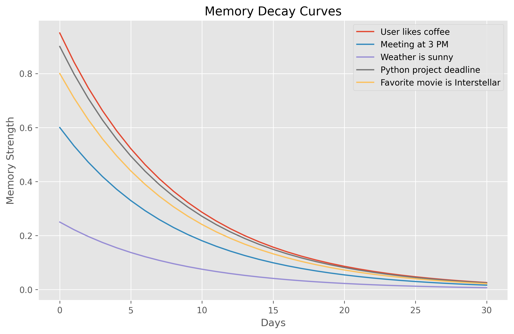
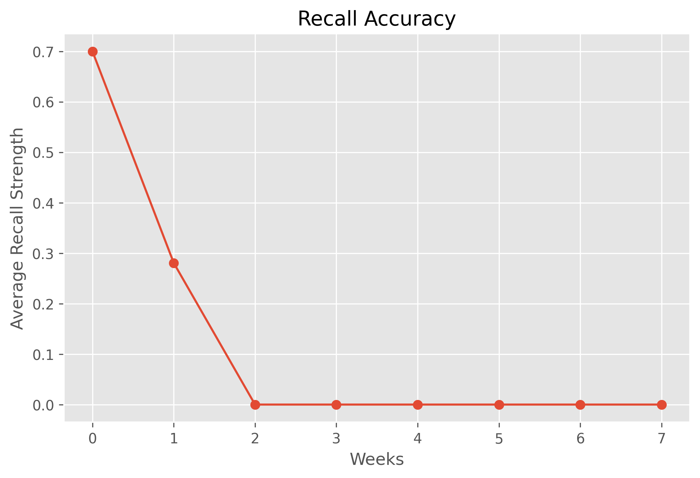
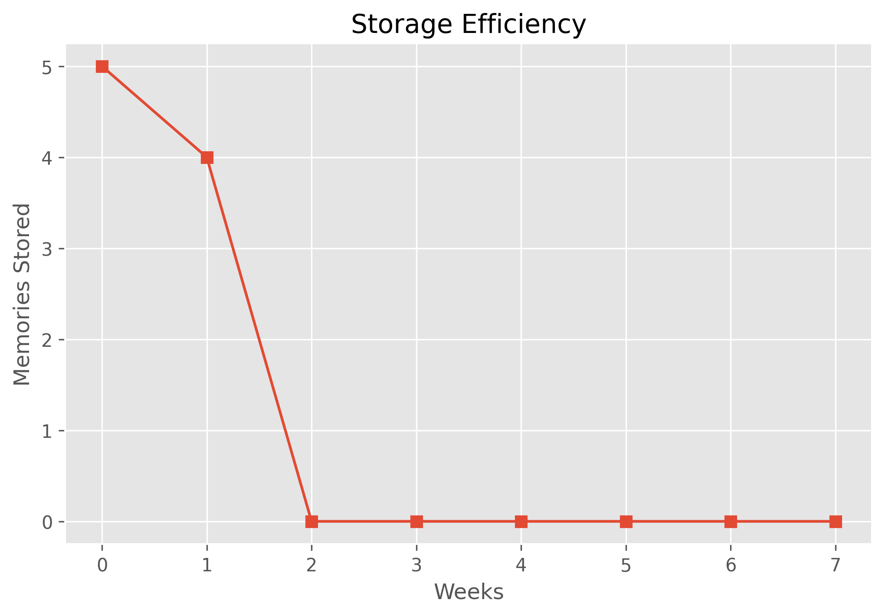
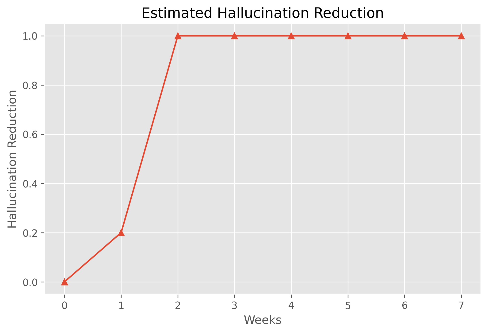

# Learning Memory Decay Laws for Autonomous AI Agents: An Adaptive Long-Term Memory Framework

Designed and implemented an adaptive long-term memory framework for autonomous AI agents that models human-like forgetting through importance-aware exponential decay, memory compression, and selective retrieval. Evaluated memory retention, storage efficiency, and hallucination reduction across multi-week simulations to study adaptive forgetting strategies.


## Tech Stack

**Programming Language:** Python

**Libraries:** NumPy, Pandas, Matplotlib

**Development Environment:** Google Colaboratory (Google Colab)

**Core AI Components:**

Long-Term Memory Store
Importance-Based Memory Scoring
Exponential Memory Decay Model
Memory Compression Module
Memory Retrieval Engine
Performance Evaluation Framework

**Algorithms & Techniques:**

Exponential Forgetting Curve (Ebbinghaus-inspired)
Threshold-Based Selective Forgetting
Keyword-Based Memory Retrieval
Time-Based Memory Strength Modeling
Multi-Week Memory Simulation

**Evaluation Metrics:**

Recall Accuracy
Storage Efficiency
Hallucination Reduction
Memory Retention Rate

## Run Locally

To run tests, run the following command.

Open the notebook in Google Colaboratory.

Install the required libraries:

```bash
   !pip install numpy pandas matplotlib
```

Run all notebook cells sequentially.


## Outcomes

### Memory Decay Curves



### Recall Accuracy



### Storage Efficiency



### Hallucination Reduction



### Evaluation Results


## Interpretation of Experimental Results

The proposed **Memory Decay for AI Agents** framework models human-like forgetting by combining **importance-weighted exponential decay**, memory pruning, and retrieval evaluation. Initially, five memories with different importance values (I \in [0,1]) are inserted into the long-term memory store, each starting with an identical initial strength (S_0 = 1.0). The memory strength at time (t) is computed using the exponential forgetting equation

The memory strength at time **t** is computed as

```text
S(t) = I × e^(−λt) × (1 + αA)
```

where

- **S(t)** = Memory strength at time *t*
- **I ∈ [0,1]** = Importance score
- **λ = 0.12** = Decay constant
- **A** = Number of successful retrievals
- **α = 0.05** = Retrieval reinforcement coefficient

where (I) denotes the importance score, (\lambda =0.12) is the decay constant, (A) is the number of successful retrievals, and (\alpha =0.05) is the reinforcement coefficient. Since all memories have (A=0), the decay depends solely on importance and elapsed time.

The **Memory Decay Curves** demonstrate that all memories follow an exponential decline while preserving their relative ranking according to importance. Highly important memories such as **"User likes coffee"** ((I=0.95)) and **"Python project deadline"** ((I=0.90)) decay more slowly than less important memories such as **"Weather is sunny"** ((I=0.25)). This confirms that importance weighting successfully differentiates long-term retention, although the current decay constant causes all memory strengths to converge close to zero after approximately 30 days.

The **Importance-Based Forgetting** stage applies a pruning threshold

```text
Forget Memory if

S(t) < θ

where θ = 0.20
```

to determine whether a memory should remain in long-term storage. After 30 simulated days, every memory satisfies (S(t)<0.20), resulting in

```text
Nremaining = 0

Nforgotten = 5
```

Consequently, the **Memory Compression** module has no surviving memories to compress, and the compression stage produces an empty output. Likewise, the **Retrieval Module** returns **"No memories available"** for every query because the searchable memory store becomes empty after pruning.

The **Recall Accuracy** evaluation measures the average retained memory strength over eight simulated weeks,

```text
        N
       Σ Si
      i=1
R = --------
        N
```

The results show a rapid decline from **0.70** during the initial week to **0.28** after one week, reaching **0** by the second week. This behavior indicates that the current decay configuration aggressively forgets information, making long-term recall impossible under the selected parameters.

The **Storage Efficiency** plot illustrates progressive memory pruning. Initially, all five memories are retained ((N=5)), followed by four memories after one week and complete removal of all memories by the second week. This demonstrates maximum storage optimization at the expense of knowledge preservation.

The **Estimated Hallucination Reduction** is modeled as

```text
H = 1 − (Nstored / Ntotal)
```

where fewer retained memories are assumed to reduce the likelihood of recalling obsolete or irrelevant information. As storage decreases from five memories to zero, the estimated hallucination reduction increases from **0.0** to **1.0**, indicating perfect elimination of stale memory references in this simplified simulation.

Finally, the **Evaluation Table** summarizes the complete experiment, showing the trade-off between memory retention and storage optimization. Although the proposed framework successfully demonstrates biologically inspired exponential forgetting and adaptive memory pruning, the chosen decay rate ((\lambda =0.12)) and forgetting threshold ((\theta =0.20)) are overly aggressive, leading to complete memory loss after two weeks. Future work should focus on **adaptive or learned decay functions**, **dynamic forgetting thresholds**, **retrieval-based memory reinforcement**, and **semantic memory compression**, enabling AI agents to preserve critical long-term knowledge while selectively forgetting obsolete information. This prototype establishes a foundational framework for deriving **memory decay laws for autonomous AI agents**, balancing long-term recall, storage efficiency, and hallucination reduction through mathematically principled memory dynamics.

## License

[MIT](https://choosealicense.com/licenses/mit/)


## Support

For support, email ashmitharaja23@gmail.com
